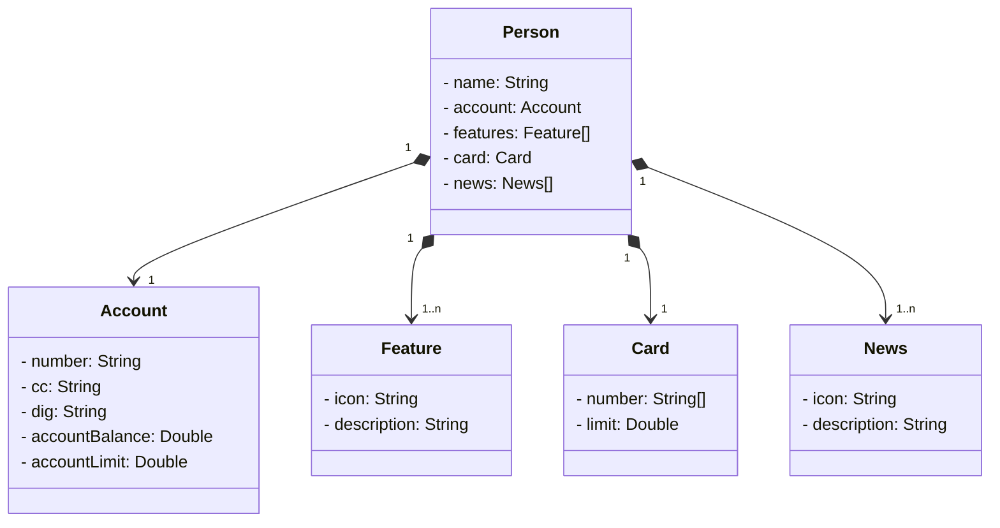

# API REST na Nuvem (Santander Bootcamp)

Este projeto tem como objetivo atender ao requisito do Bootcamp FullStack Java & Angular oferecido em conjunto pela DIO e Santander Universidades.

## Tecnologias e Dependencias aplicadas:
- Java
- Gradle
- H2 Database
- PostgreSQL
- SpringBoot Web
- SpringBoot JPA

## Diagrama de Classes

